# Graphics Retracing

**KYLE KOHL, Iowa State University, USA**

The goal of this project was to develop a raytracer capable of rendering realistic images by simulating light interactions with objects. The implementation includes features such as anti-aliasing, various material properties, texture mapping, and optimizations like Bounding Volume Hierarchies (BVH). The project leverages object-oriented design, with a modular class structure to ensure scalability.

## 1. Introduction
Figure 1: Bouncing Spheres  
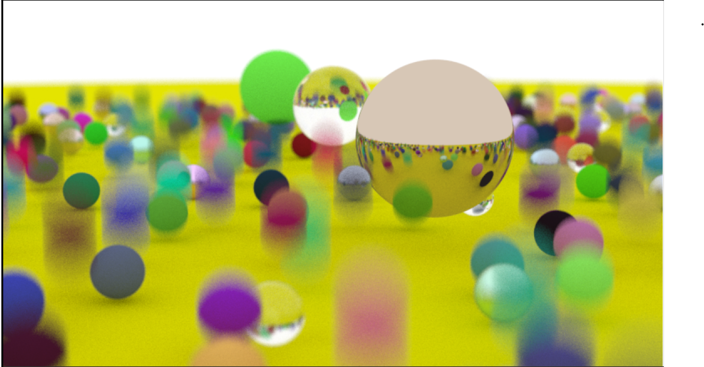
*Multiple spheres with varying materials and lighting demonstrating ray-sphere intersection and material handling.*

336 Ray-tracer Project Write-Up

This document outlines the features implemented in my 336 Raytracer project. The project adheres to the guidelines provided and incorporates additional functionality inspired by *"Ray Tracing in One Weekend"* and *"Ray Tracing: The Next Weekend"*. Below, I detail each implemented feature and its corresponding technical aspects. The basic outline of my program is that in the Main class, there are several pre-loaded scenes that will create all the objects, add them to the BVH, adjust the camera viewing, and render the world. The Camera class is the heart of the project as most of the magic happens there. All Classes were named appropriately to help navigation of the project.

---

## 2. Standard Features:

### 2.1. Camera Features

The project includes a robust camera system capable of: Configurable Position and Orientation The camera’s position and direction can be adjusted to suit different scenes.

### 2.2. Field of View (FoV) Control

A customizable FoV is available to provide flexibility in rendering. These functionalities are encapsulated in a ‘Camera‘ class, which houses four public variables for position, orientation, and FoV. Default values are provided, but they can be overridden for specific scenes to tailor the viewing experience.

---

### 2.3. Anti-Aliasing and Ray/Sphere Intersections

Figure 2: Anti-Aliasing —
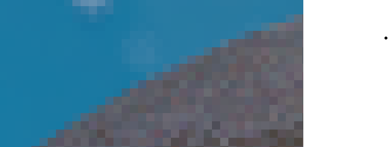
*Zoomed-in render of a sphere with anti-aliasing enabled for smoother edges.*

### 2.3.1. Anti-Aliasing

Controlled by a ‘samplesPerPixel‘ variable, anti-aliasing is achieved by casting multiple random rays per pixel to produce smoother and more accurate color values. Figure 2 is a zoomed in view of a sphere using Anti-Aliasing.

---

### 2.3.2. Ray/Sphere Intersections

Implemented using a ‘Ray‘ and ‘Sphere‘ class, this functionality ensures accurate intersection calculations. The ‘Sphere‘ class extends the ‘Hittable‘ interface to allow interaction with other geometric primitives. The effectiveness of these features is showcased in images that demonstrate the handling of multiple spheres with varying lighting and material properties. Figure 1 demonstrates this very well.

---

### 2.4. Material Properties

The project supports:

### 2.5. Diffuse Materials

Chalky in appearance, this is represented in the Lambertian class.

### 2.6. Specular Materials

Distinct by the reflective surface, this is represented by the Metal class.

### 2.7. Dielectric Materials

Simulated by transparent objects such as glass, this is represented by the Dielectric class. These materials are implemented using an abstract ‘Material‘ class, which is extended by specific material types. In figure 1, you can see three big balls. The closest one is specular with high reflection. The middle ball is dielectric material. The green ball furthest away is made of a diffuse material.

---

### 2.8. Emissive Materials (Lights)

Emissive materials enable realistic lighting within scenes. The ‘DiffuseLight‘ class, extending the ‘Material‘ class, manages light-emitting surfaces. Example renders highlight the interplay of light and shadow. In figure three, you can see two golden colored DiffuseLight spheres casting light over the globe in between them.

Figure 3: Lights —
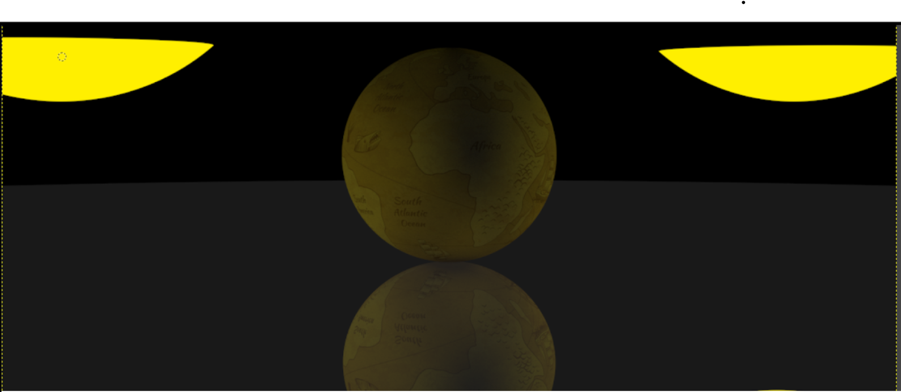
*Two emissive DiffuseLight spheres casting realistic lighting on a globe.*

---

### 2.9. Sphere Textures

Textures are applied to spheres using an ‘RTWImage‘ class to load image files and transform them into RGB values. These values are processed by the ‘ImageTexture‘ class to generate usable textures for any ‘Hittable‘ object. This feature is demonstrated in figure 3 as an image of a sphere with a world map texture.

---

### 2.10. Bounding Volume Hierarchies (BVH)

BVH acceleration structures were implemented to optimize ray tracing performance. The ‘BVHNode‘ and ‘AABB‘ classes manage axis-aligned bounding boxes for hierarchical object grouping. Every hittable object has a bounding box to implement the BVH. Testing on figure 1 revealed significant performance improvements:

- With BVH: 6 minutes, 20 seconds.
- Without BVH: 20 minutes, 16 seconds.

---

### 2.11. Ray/Triangle Intersections and Meshes

### 2.12. Triangles

The ‘Triangle‘ class, extending ‘Hittable‘, supports material properties identical to spheres. Figure 4 showcases two triangles, one of diffuse material, the other of dielectric.

Figure 4: Triangles —
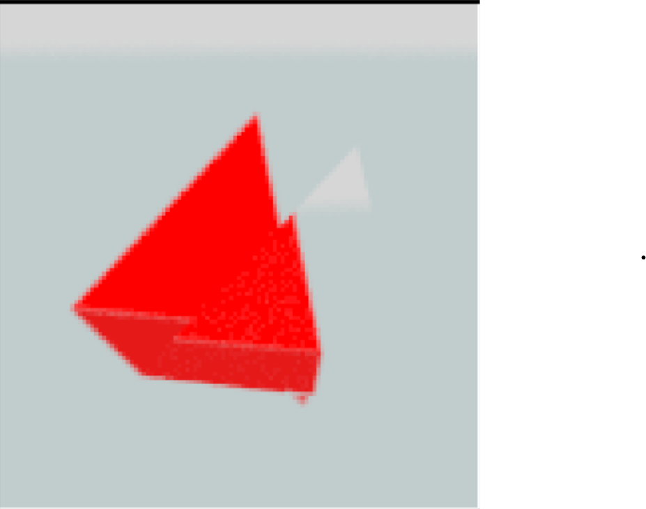
*Two triangles rendered with different materials—diffuse and dielectric.*

---

### 2.13. Triangle Meshes

The ‘Triangle-mesh‘ class accepts vertex and index lists to construct complex shapes using the Triangle class. This feature successfully rendered an OBJ file of a teapot, demonstrating functionality for intricate models.

Figure 5: Triangle Mesh —
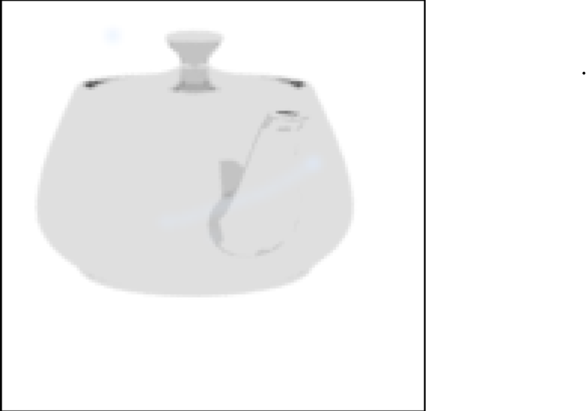
*Rendered teapot model using triangle mesh and ray-triangle intersection.*

---

### 2.14. Texture Mapping for Meshes

Textures can be applied to triangle meshes. An example render shows a textured triangle mesh with a world map. While results on complex meshes (like the teapot) are mixed due to texture alignment, the feature is functional and provides a foundation for further refinement.

Figure 6: Textured Triangle Mesh —
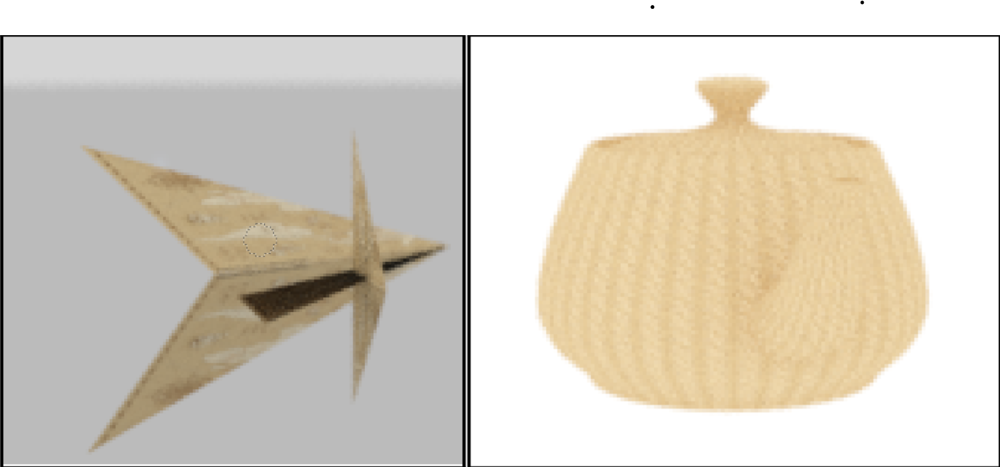
*A triangle mesh with world map texture applied, demonstrating mesh texturing.*

---

## 3. Extra Features

### 3.1. Motion Blur and Depth of Field

Motion Blur is achieved by modifying the sphere’s position over time. A secondary constructor accepts two vectors for the initial and final centers, simulating motion between frames.

Depth of Field (De-focus Blur) is implemented using two parameters in the ‘Camera‘ class to control the aperture and focus distance. Objects closer to the focal plane appear sharper, while others blur progressively. Both features contribute to a dynamic and realistic rendering experience and can be easily observed in figure 1.

---

### 3.2. Volume Rendering

This project successfully renders volumes. This has the smoke like appearance. This was does with two classes called ConstantMedium and Isotropic.

Isotropic extends Materials, it has a scattered and emitted method. These two together give it that smoke-like appearance.

ConstantMedium extends Hittable. It has the standard hit method but also an Isotropic variable called phaseFunction that gives it the smoke like look while being a hittable object. This class models a volumetric medium with a constant density within a given boundary, this is defined by the Hittable boundary. It is used to simulate the interaction of light with a volumetric medium in Ray Tracing. You can see in figure 7 a sphere made of the Isotripic with the smoke like apperance.

Figure 7: Smoke and Checkers —
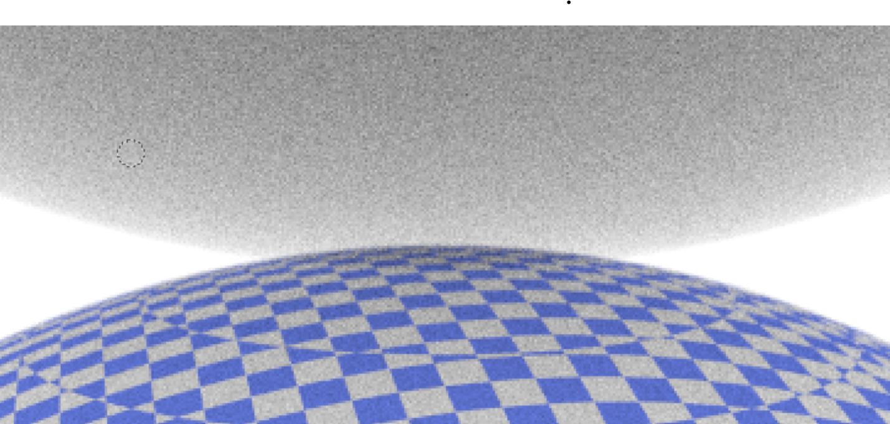
*A sphere above rendered with isotropic volume rendering, creating a smoke-like effect. A sphere below using a checkers texture pattern.*

---

### 3.3. Quads

This is implements by the class Quads and the results can be seen in figure 8. It makes a surface from three vertexes to form the quad. The method used to make quads came from the book and it has the added bonus of having object instancing. You can see in figure 8 a few quads render on top of each other.

Figure 8: Quads —
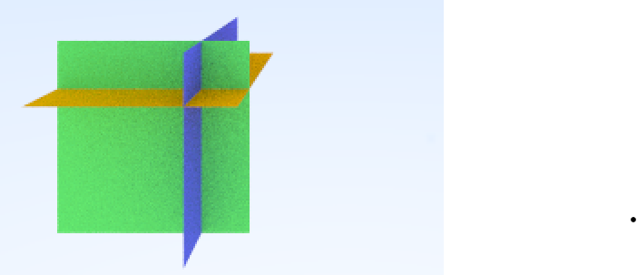
*Stacked quads demonstrating surface generation and object instancing.*

---

### 3.4. Perlin Noise

This is implemented in two classes called Perlin and NoiseTexture following the steps laid out in the book and the results can be scene in figure 9.

Perlin has a TV static appearance, created by a combination of 3 for loops, generating random vectors. and using trilinear interpolation for smooth shading.

The class NoiseTexture extends Texture and can be added to any hittable object. It uses the Perlin class and a variable scale that controls the level of noise.

Figure 9: Perlin Noise —
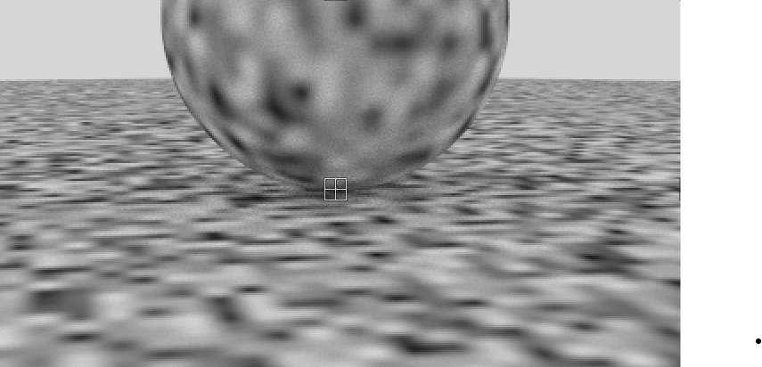
*A sphere with Perlin noise texture showing natural noise-based patterning.*

---

### 3.5. Cube Map

The cube map implements a cube of maps inside our world space. Whenever a ray does not hit a hittable object, it goes to infinity inside of the cube box. This was implemented in a class called CubeMap that is added to the Camera class. It is compromised of 6 images that are loaded in. It has a method that will return a color given a vector of direction. This is used in the camera class when it doesn’t hit any objects. Figure 10 shows the corner of our Cube Map where 3 sides of space images come together.

Figure 10: Cube Map Corner —
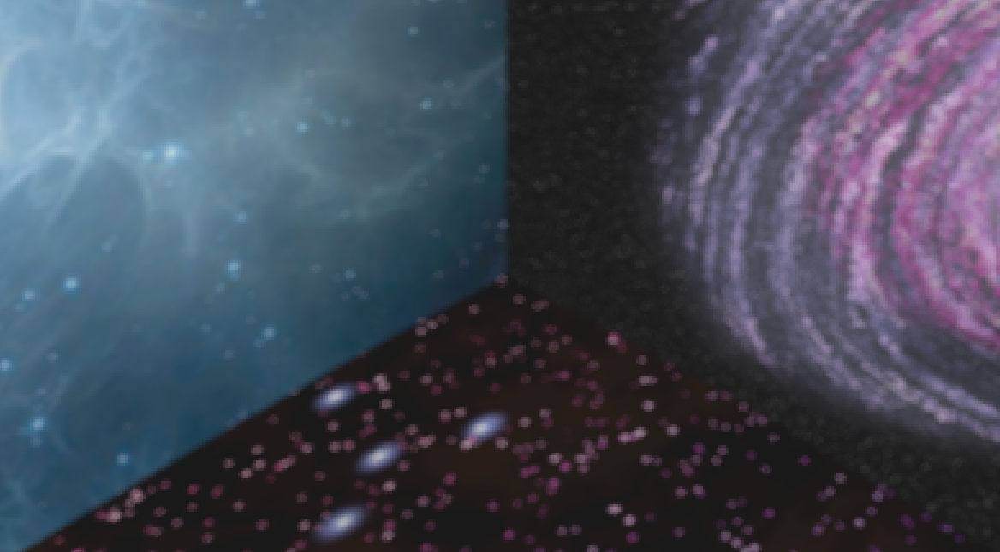
*Corner view of three space-themed images forming a cube environment for rays that don’t hit objects.*

---

### 3.6. Object Instancing

This was achieved by the Quad class and by triangle meshes.

For the Quad class, following the book resulted in me being able to create boxes out of the quads and put them dynamically in the world scene.

For the triangle mesh, the project has the functionally of translation, rotation, and scalability. This can be seen in my final image where I translated the triangle mesh of the Tardis to the upper left corner and rotated the ship 45 degrees about the y-axis.

---

### 3.7. Parallelization

This was a much needed improvement that speeds up the project around 700 percent on my laptop and 1600 percent on my PC. This is due to 7 and 16 cores compared to a single core with a single thread. This was implemented in the Camera class in the render method, specifically on lines 190 to 273. There were a few iterations of this improvement. The first was to divide the image into chunks, and let each thread work a chunk. Inevitable one thread will always finish first and one will always finish last. To make it more even and not have wasted threads, the new method was to put all the work in a queue, and the threads work until all the work in the queue was done. The last part was to add a progress counter that displayed the progress to the console. This technically worked but resulted in a scrambled image as all the threads wrote there their pixel to the file whenever they were done. The solution to all scrambled images problems was to have the threads put there result in a 2D Color array that held all the colors for a file and then write to file after all the pixels were calculated. This worked beautifully and solved all problems while achieving all intended results.

---

## 4. Conclusion

Figure 11: Space Scene —
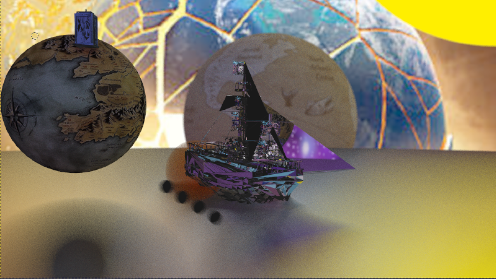
*This was a scene designed to show all the capabilities of the Raytracer put into one image. It has a picture of a world exploding in the far back from the cube map. There are two textured spheres, one of earth and the other of middle-earth. There is a emissive sphere/sun in the top right. There is a red sphere made of somke supposed to simulate an explosion. Finally, there are two triangle meshes. One is a blue duffuse Tartis and the other is a metal ship.*

All required features for the project have been implemented, alongside additional enhancements. These include motion blur, depth of field, quads, object instancing, Perlin noise, cube maps, parallelization, and volume rendering. This project was definitely a learning experiencing that greatly enhanced my understanding of Ray-tracing and gave me a new appreciation for the hard work that is done by game engines along with all other programs that have to render in a 3D World space. The project demonstrates a comprehensive understanding of ray tracing principles and efficient implementation techniques. It was very fun to work on, Thank you.
